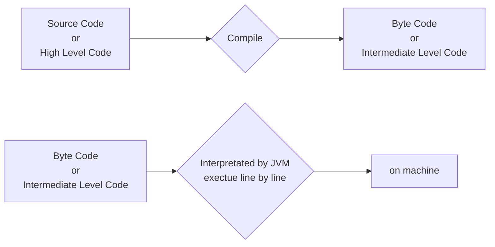

# Core Java
1. What is Java?  
	Java is Programing language where language is a medium which is need for communication.  
	Programming Language is needed in Order to Communicate with Computers or Machines.

2. What is Programs?    
	Programs refers to set of instructions it is necessary to write program in order to develop application.
3. What is Application  
	Application refers to collections of multiple different programs.  
	The goal of any application is to perform some specific task.

## Type of code

1. High Level Code
	if set of instruction is in human readable format then it is called as High Level Code.
	It is also know as Source Code.
2. Intermediate level Code
	if set of instruction partially human readable and partially machine readable then it is called as intermediate level code.
	It is known as Byte Code (in Java). 
3. Low Level Code
	if set of instruction is in binary or machine readable then it is called as Low Level Code
	It is known as Machine Code.

## Execution of Java Program

It a 2 step process   

1. Compilation  
	Compilation is the process of converting one language in to other language
2. Interpretation  
	Interpretation is the process of coverting intermediate code to low level code.

