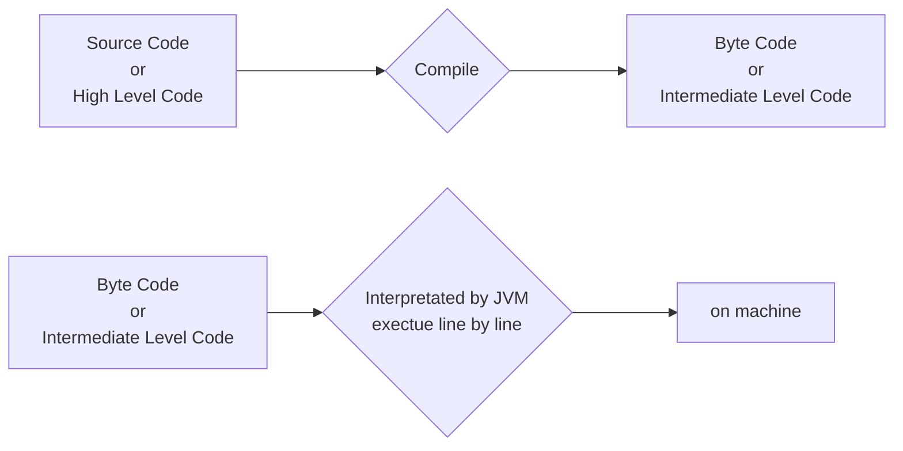
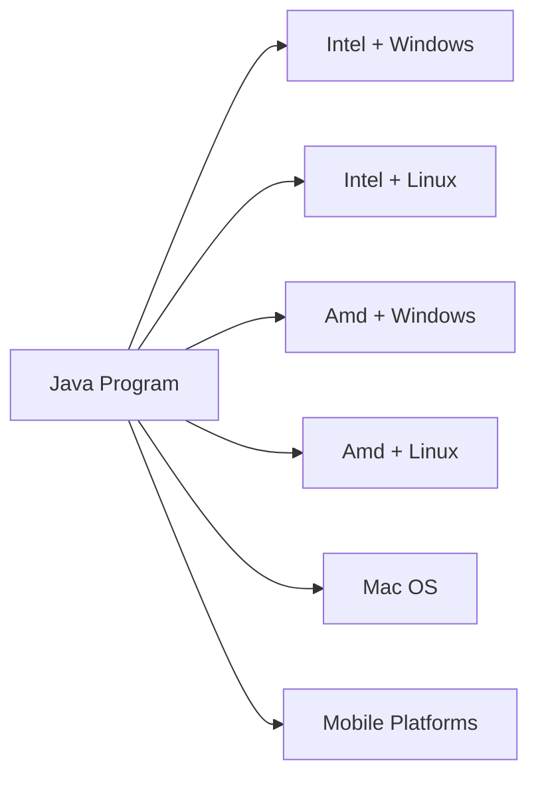

# Fundamental of Java
1. What is Java?  
	Java is Programing language where language is a medium which is need for communication.  
	Programming Language is needed in Order to Communicate with Computers or Machines.
2. What is Programs?    
	Programs refers to set of instructions it is necessary to write program in order to develop application.
3. What is Application  
	Application refers to collections of multiple different programs.  
	The goal of any application is to perform some specific task.

## Type of code

1. High Level Code
	if set of instruction is in human readable format then it is called as High Level Code.
	It is also know as Source Code.
2. Intermediate level Code
	if set of instruction partially human readable and partially machine readable then it is called as intermediate level code.
	It is known as Byte Code (in Java). 
3. Low Level Code
	if set of instruction is in binary or machine readable then it is called as Low Level Code
	It is known as Machine Code.

## Execution of Java Program

It a 2 step process   

1. Compilation  
	Compilation is the process of converting one language in to other language
2. Interpretation  
	Interpretation is the process of coverting intermediate code to low level code.



## Platform

Platform is infrastructure for other services, a software platform provide infrastructure to run other applications.

Platform is basically is a device which is combination of hardware and software. that is processor and operating system.

Platform is need in order to run or develop applications.  

Java is Platform independent that is Java does not depends upon particular platform and it follow WORA(Write Ones Run Anywhere) Architecture.



## Keywords


Keywords are basically a collection of predefine words where every keywords is unique(different) from one another.  

Without keywords we can't write any java program. Keywords will help us building java programs also they help us in providing the program structure.  

Java supports single purpose keyword as well as multiple purpose keywords.  

All the keywords in java has to be in lower case.  
## Syntax and Structure of java programs

Java is class based programing language.  
```java
class ClassName
{
	//class - members
}
```

### class members

1. state/properties
2. behavior/methods
3. constructors
4. blocks
5. main - method.

### Boiler plate code
-> minimum format of code to run a program.
```java
class ClassName
{
	public static void main(String [] args){
		//instuction
	}
}
```

>[!Note]Interview Questions  
>1. <b>Is main method mandatory for Java program?</b>  
>	Main method is not mandatory for java program but it is necessary at the time of execution because main method will act as starting point for execution and it controls the program execution flow.  
>2. <b>Can we define more than one main method?</b>  
>	According to the Concepts of method overloading it is possible to define more than one main method but we need to follow overloading rules 
>	that is same name but signature of method should be different.
>3. 
>```java 
>class ClassName
>{
>	static public void main(String[] args){
>		//instructions
>	}
>}
>```
>	***It is possible to interchange static and public keyword*** with respect to main method because
>	java doesn't define **specific order** for access specifier and access modifiers.  
> 
## Identifiers 

any name which is used in a program can be called as identifiers.  
### Rule for identifiers
1. identifiers cannot start  with a number.  
	class 15ProMax ❌  
	class iPhone15pro ✔️  
2. identifier cannot have space.
	int S23 Ultra ❌  
	class S23Ultra ✔️  
3. identifier cannot have special character except $, _
	A. class java-fs ❌  
	B. class Java.10.30 ❌  
	C. class $India ✔️  
4. identifier cannot be keywords
	A. class public❌  
	B. class Class ✔️  
	C. class static ❌  
5. no restriction on upper and lower case.
	class bike ✔️  
	class Employee ✔️   
	
>[!note]Good Practice for Naming Conventions
>```mermaid
>graph LR
>
>A[class] -->|Pascal Case| B[ClassName];
>C[interface] --> D[InfName];
>E[variable] -->|Camel Case| F[varName];
>G[method] --> H[methodName];
>I[arrays] --> J[arrName];
>```

